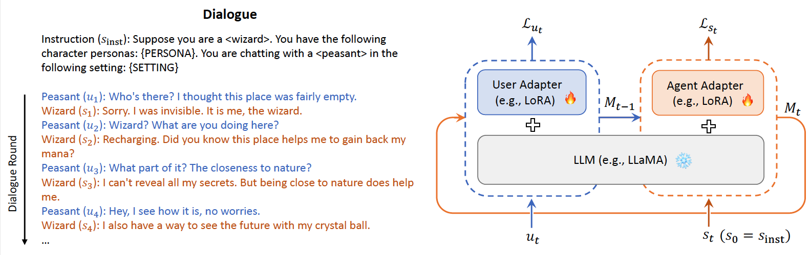

# Midi-Tuning

[*Instruct Once, Chat Consistently in Multiple Rounds*: An Efficient Tuning Framework for Dialogue](https://arxiv.org/abs/2402.06967) (ACL 2024)

We propose an efficient Multi-round Interactive Dialogue Tuning (Midi-Tuning) framework. It models the agent and user individually with two adapters built upon large language models. The adapters make use of respective utterances round by round in alternating order and they are tuned via a round-level memory caching mechanism.

<p align="center">

</p>


## Requirements
The required packages are listed in `requirements.txt`. Suppose you use [Anaconda](https://www.anaconda.com/) to manage the Python dependencies, you can install them by running:
```bash
conda create -n midi python=3.10
conda activate midi
pip install -r requirements.txt
```

## Datasets

We evaluate our Midi-Tuning framework on two datasets: [LIGHT](https://aclanthology.org/D19-1062.pdf), which is a character-based dialogue dataset, and [TopDial](https://aclanthology.org/2023.emnlp-main.72.pdf), which is a target-oriented proactive
dialogue dataset. The datasets can be downloaded from the following links:
- LIGHT ([OneDrive](https://connectpolyu-my.sharepoint.com/:u:/g/personal/21037774r_connect_polyu_hk/EVvR5GMWJlxFjUpAXuJJ8hcBkZ_BwV3Iz2GFYWJv1uAobQ?e=A1P05h))
- TopDial ([GitHub](https://github.com/iwangjian/TopDial))

*Note*: For custom datasets, you can refer to the `data/dummy_data.json` for the data format.

## Quickstart

The LLMs used in our experiments are downloaded from the following Hugging Face model hubs:
- [LLaMA-7B](https://huggingface.co/yahma/llama-7b-hf)
- [Mistral-7B-v0.1](https://huggingface.co/mistralai/Mistral-7B-v0.1)
- [Vicuna-7B-v1.3](https://huggingface.co/lmsys/vicuna-7b-v1.3)
- [Llama 2 Chat-7B](https://huggingface.co/meta-llama/Llama-2-7b-chat-hf)

Suppose you have downloaded the tokenizer and the checkpoints of an LLM `{MODEL_NAME}` and put them into the `pretrained/{MODEL_NAME}` directory, you can run the following commands for training, inference, and evaluation.

### Training 
```bash
deepspeed --master_port=29600 --include="localhost:0,1" src/midituning/finetune.py \
    --model_name_or_path pretrained/${MODEL_NAME} \
    --data_path data/${DATASET_NAME}/data_fmt_dialog/train.json \
    --weight_beta 1.0 \
    --max_instruction_length 256 \
    --max_utterance_length 72 \
    --max_rounds 10 \
    --num_proc 8 \
    --output_dir logs/${DATASET_NAME}/midi_${MODEL_NAME} \
    --per_device_train_batch_size 1 \
    --per_device_eval_batch_size 1 \
    --gradient_accumulation_steps 16 \
    --num_train_epochs 3 \
    --evaluation_strategy "no" \
    --learning_rate 2e-5 \
    --warmup_ratio 0.03 \
    --lr_scheduler_type "cosine" \
    --logging_steps 10 \
    --save_strategy "steps" \
    --save_steps 100 \
    --save_total_limit 3 \
    --lora_r 8 \
    --lora_alpha 16 \
    --lora_dropout 0.05 \
    --q_lora True \
    --deepspeed config/deepspeed_config_s2.json
```

### Inference
```bash
export CUDA_VISIBLE_DEVICES="0,1"

accelerate launch --main_process_port 29600 \
    --multi_gpu --num_processes=2 \
    --num_machines=1 \
    --mixed_precision=no \
    --dynamo_backend=no \
    src/midituning/generate.py \
    --model_path logs/${DATASET_NAME}/midi_${MODEL_NAME} \
    --test_data_path data/${DATASET_NAME}/data_fmt_dialog/test.json \
    --test_unseen_data_path data/${DATASET_NAME}/data_fmt_dialog/test_unseen.json \
    --output_dir results/${DATASET_NAME}/midi_${MODEL_NAME}\
    --max_instruction_length 320 \
    --max_utterance_length 100 \
    --max_rounds 10 \
    --max_new_tokens 100 \
    --temperature 0.5 \
    --top_p 0.75 \
    --top_k 40
```

### Evaluation

For commonly used automatic evaluation metrics for dialogue generation, you can run the following commands:
```bash
# for LIGHT dataset
python eval/eval_light.py \
    --eval_file results/light/midi_${MODEL_NAME}/test_output.jsonl \
    --gold_file data/light/light_test.jsonl 

python eval/eval_light.py \
    --eval_file results/light/midi_${MODEL_NAME}/test_unseen_output.jsonl \
    --gold_file data/light/light_test_unseen.jsonl
```

To measure the consistency probability, you can first download the `BERT-base-uncased` model from [Hugging Face](https://huggingface.co/google-bert/bert-base-uncased) and put all the files into the `pretrained/bert-base-uncased` directory. Then, you can run the following commands to build a consistency estimator:
```bash
# training
python src/detector/run.py --data_dir data/${DATASET_NAME} \
    --output_dir logs/${DATASET_NAME}/detector \
    --bert_model pretrained/bert-base-uncased \
    --architecture "detect" \
    --max_length 500 \
    --train_batch_size 32 \
    --eval_batch_size 32 \
    --learning_rate 2e-5 \
    --warmup_steps 500

# evaluation
python src/detector/run.py --eval --plot --data_dir data/${DATASET_NAME} \
    --output_dir logs/${DATASET_NAME}/detector \
    --bert_model pretrained/bert-base-uncased \
    --max_length 500 \
    --eval_batch_size 32
```
Afterward, you can compute the consistency probability by adding the `--detector_model logs/${DATASET_NAME}/detector` argument when runing `eval/eval_light.py` or `eval/eval_topdial.py`.

To obtain GPT-4 scores, you should first have an OpenAI API key and store it into a file, e.g., `openai_api_key.txt`. Then, you can run the following command:
```bash
# for LIGHT dataset
python eval/eval_by_gpt.py \
    --eval_file results/light/midi_${MODEL_NAME}/test_output.jsonl \
    --gold_file data/light/light_test.jsonl \
    --prompt_template prompt/eval_light.txt \
    --model "gpt-4-turbo"
```

## Citation
If you find our code useful for your work, please kindly cite our work as:
```bibtex
@inproceedings{wang-etal-2024-instruct,
  title={Instruct Once, Chat Consistently in Multiple Rounds: An Efficient Tuning Framework for Dialogue},
  author={Wang, Jian and 
      Leong, Chak Tou and 
      Wang, Jiashuo and 
      Lin, Dongding and 
      Li, Wenjie and 
      Wei, Xiao-Yong},
  booktitle={Proceedings of the 62nd Annual Meeting of the Association for Computational Linguistics (ACL)},
  year={2024}
}
```